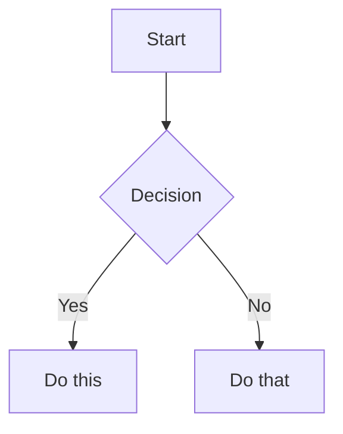

# Logseq Flavored Markdown Skill

Create and edit valid Logseq Markdown. Logseq extends CommonMark with a block-based outliner structure, bidirectional links, block references, inline properties, and built-in task management. This skill covers Logseq-specific extensions — standard Markdown syntax is assumed knowledge.

## Core Concept: Everything Is a Block

Unlike Obsidian, Logseq content is **entirely block-based**. Every piece of content lives inside a bullet-point block (`- `). Blocks can be nested to any depth using indentation (tabs).

```markdown
- This is a top-level block
	- This is a nested block (child of the block above)
		- This is a grandchild block
	- Another child block
- Another top-level block
```

> Never write free-form paragraphs outside of blocks. Every line of content must belong to a block starting with `- ` or be a continuation/property line indented under a block.

## File Structure

### Pages (`pages/` directory)

Page files are named with the page title. Spaces become underscores or `%20` depending on graph settings.

```
pages/my-page.md
pages/Project%20Alpha.md
pages/namespace___child.md   ← namespace separator is ___
```

A page file consists of blocks starting with `- `:

```markdown
- Page-level property block (optional — see PROPERTIES.md)
  tags:: project, active
  status:: in-progress

- First content block
	- Nested child block
```

### Journal Pages (`journals/` directory)

Named by date in the format configured in your graph settings (commonly `YYYY_MM_DD.md`):

```
journals/2024_01_15.md
```

## Internal Links (Page References)

```markdown
[[Page Name]]                    Link to a page (creates it if it doesn't exist)
[[Page Name|Display Text]]       Custom display text (Markdown link style in some versions)
[[namespace/child]]              Link to a namespaced page
#tag                             Inline tag (also creates a page named "tag")
#[[multi word tag]]              Multi-word inline tag
```

> Page links are bidirectional: linking to `[[My Note]]` automatically makes `My Note` list the current page in its backlinks.

## Block References

Every block has a unique UUID that can be used to reference or embed it from anywhere in the graph.

```markdown
((block-uuid))                   Inline reference to a specific block
```

To find a block's UUID: open the block context menu → "Copy block ref", or look for `id:: ` property on the block.

A block UUID looks like: `6626d597-5ecf-4a9e-bd57-7dde55e1cecd`

## Embeds

```markdown
{{embed [[Page Name]]}}          Embed an entire page inline
{{embed ((block-uuid))}}         Embed a specific block inline
```

Embeds render the content live and stay in sync — editing the original updates all embed locations.

## Properties

Logseq uses `key:: value` inline syntax instead of YAML frontmatter. See [PROPERTIES.md](references/PROPERTIES.md) for full reference.

```markdown
- title:: My Custom Page Title
  tags:: project, active
  status:: in-progress
  date:: [[2024-01-15]]
```

**Page properties**: The first block of a file becomes page-level metadata **only when it contains exclusively properties** — no other content. Any visible text in that block, or any content before the properties, demotes them to regular block-level metadata. The most common mistake is adding a header or sentence above the properties.

```markdown
<!-- CORRECT: first block is properties-only -->
- tags:: project
  status:: active

- ## Overview
	- Content starts here.

<!-- WRONG: first block has content, so properties become block-level, not page-level -->
- # My Page Title
  tags:: project
```

**Block properties**: Properties on any block that is not the property-only first block are block-level metadata, queryable per-block.

## Tasks

Logseq has a built-in task system. See [TASKS.md](references/TASKS.md) for full reference.

```markdown
- TODO Write the report
- DOING Review pull requests
- DONE Deploy to production
- LATER Read that article
- NOW Fix the critical bug
- WAITING Response from client
- CANCELLED Old idea
```

**Priority markers** (placed after the task marker):

```markdown
- TODO [#A] High priority task
- TODO [#B] Medium priority task
- TODO [#C] Low priority task
```

**Scheduled and deadline dates**:

```markdown
- TODO Write report
  SCHEDULED: <2024-01-15 Mon>
  DEADLINE: <2024-01-20 Sat>
```

## Tags

```markdown
#tag                             Single-word tag
#[[multi word tag]]              Multi-word tag
```

Tags and page links are functionally the same in Logseq — both create pages and backlinks. Use `#tag` as shorthand for `[[tag]]`.

## Namespaces

Namespaces create hierarchical page organization using `/` in page names:

```markdown
[[Projects/Alpha]]              Link to "Alpha" inside "Projects" namespace
[[Projects/Alpha/Tasks]]        Deeply nested namespace
```

In file names, the `/` separator is encoded based on the `:file/name-format` setting in `logseq/config.edn`. The default in modern Logseq is `:triple-lowbar`:
- `[[Projects/Alpha]]` → `pages/Projects___Alpha.md` (`:triple-lowbar`, default)
- `[[Projects/Alpha]]` → `pages/Projects%2FAlpha.md` (`:legacy`, older graphs)

Do not manually rename files to change namespace membership — use Logseq's rename feature.

## Queries

Inline simple queries render filtered block lists:

```markdown
{{query (task TODO)}}
{{query (and (task TODO) (page [[My Project]]))}}
{{query (property :status "doing")}}
```

See the [logseq-queries](../logseq-queries/SKILL.md) skill for full query syntax.

## Highlights and Formatting

```markdown
^^highlighted text^^             Highlight (Logseq-specific)
~~strikethrough~~                Strikethrough
==highlighted text==             Alternative highlight syntax
```

## Math (LaTeX)

```markdown
Inline: $e^{i\pi} + 1 = 0$

Block:
$$
\frac{a}{b} = c
$$
```

## Diagrams (Mermaid)

````markdown

````

## Code Blocks

````markdown
```javascript
const x = 1;
```
````

## Logbook (Task Time Tracking)

Logseq automatically appends a logbook when clocking tasks:

```markdown
- DONE Write the report
  :LOGBOOK:
  CLOCK: [2024-01-14 Sun 09:00]--[2024-01-14 Sun 11:00] =>  2:00
  :END:
```

## Org-mode Style Special Blocks

Logseq supports org-mode `#+BEGIN_*` blocks:

```markdown
#+BEGIN_QUOTE
This is a block quote.
#+END_QUOTE

#+BEGIN_NOTE
This is a note.
#+END_NOTE

#+BEGIN_WARNING
This is a warning.
#+END_WARNING

#+BEGIN_TIP
This is a tip.
#+END_TIP

#+BEGIN_IMPORTANT
This is important.
#+END_IMPORTANT

#+BEGIN_CAUTION
This is a caution.
#+END_CAUTION

#+BEGIN_PINNED
This is pinned.
#+END_PINNED

#+BEGIN_EXPORT html
<p>Raw HTML</p>
#+END_EXPORT
```

## Macros

Built-in Logseq macros:

```markdown
{{youtube https://www.youtube.com/watch?v=dQw4w9WgXcQ}}
{{twitter https://twitter.com/user/status/123456}}
{{vimeo https://vimeo.com/123456}}
{{cloze answer}}                 Anki-style cloze for spaced repetition
{{renderer ...}}                 Plugin renderer invocation
```

## Timestamps

```markdown
<2024-01-15 Mon>                 Active timestamp (appears in agenda)
<2024-01-15 Mon 09:00>          Active timestamp with time
[2024-01-15 Mon]                 Inactive timestamp (does not trigger agenda)
<2024-01-15 Mon .+1w>           Repeating timestamp (every week)
```

## Complete Example

```markdown
- title:: Project Alpha
  tags:: project, active
  status:: in-progress
  started:: [[2024-01-01]]

- ## Overview
	- This project aims to improve our workflow using [[Modern Techniques]].
	- Related: [[Previous Project]] and [[Team Handbook]]

- ## Tasks
	- TODO [#A] Complete the initial design
	  SCHEDULED: <2024-01-20 Sat>
		- Consider using the approach from ((6626d597-5ecf-4a9e-bd57-7dde55e1cecd))
	- DOING Write documentation
	- DONE Set up the repository
	  :LOGBOOK:
	  CLOCK: [2024-01-10 Wed 14:00]--[2024-01-10 Wed 15:30] =>  1:30
	  :END:

- ## Notes
	- ^^Key insight^^: The algorithm runs in $O(n \log n)$.
	- {{embed [[Architecture Notes]]}}

- ## Open Questions
	- {{query (and (task TODO) (page [[Project Alpha]]))}}
```

## Re-indexing

Logseq watches the file system and auto-detects changes while the app is open. However, tell the user to re-index (**Settings → Advanced → Re-index**) after:

- Creating or renaming multiple page files at once
- Moving files between directories outside the app
- Making changes while Logseq was closed
- Backlinks, queries, or graph view look stale after bulk edits

For single-file edits with the app open, re-indexing is not needed.

## References

- [Logseq Documentation](https://docs.logseq.com/)
- [Logseq Markdown Guide](https://docs.logseq.com/#/page/markdown)
- [Block References](https://docs.logseq.com/#/page/block%20reference)
- [Namespaces](https://docs.logseq.com/#/page/namespaces)
